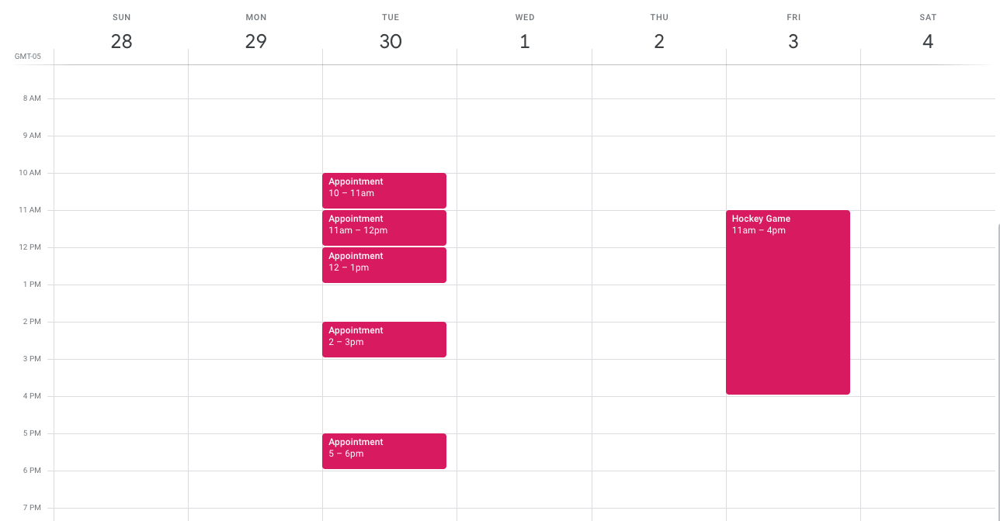

# Vetster Backend Take-Home Task: Scheduling (Fast)
Thanks for your interest in a Backend Software Engineer position at Vetster. Please read the following brief regarding this quick take-home task that will help us evaluate a few things about how you think about and write code.

### Estimated time to complete
1 Hour

### Note to Candidate
This problem was created to be based in the space that Vetster currently opperates (Pet telemedicine). **This technical problem has already been solved by our team, and we are in no way looking for free work**. This same technical assignment is given to all candidates to get an unbiased view of current technical abilites. Your time and effort completing this technical assignment is much appreciated.

### Overview
Our veterinarians are asking for a system that allows them to manage their schedule by giving them the ability to **enter time periods when they are not available** (such as when an appointment is booked, or if they have to run an errand). Since we are a global company, this solution will need to incorporate time zones. 

An example may be that Dr. Kenobi has a bunch of appointments on Tue, Nov 30th, and has a Hockey Game he is playing in on Friday, Dec 3rd. As such, he will be unable to accept any new appointments during these time periods.

This can be visualized as such:


### Data
The data could live in a database, but for the simplicity of this task, we will use a data file which should be loaded and parsed with each request. The blocked time periods can be found in `/data/blocks.json`.

The `blocks.json` contain specific dates and times `datetime_from` and `datetime_to` (which includes a timezone offset).

### What we need from you
Your task is to create a single REST API endpoint, in the language of your choice, that will accomplish the following:
- From an incoming `POST` request (with the request payload of `datetime_start` in the format `YYYY-MM-DDThh:mm:ssTZD` such as `2021-11-29T11:00:00-05:00`), return a JSON response that indicates whether Dr. Kenobi is available to be booked for an appointment.
```json
{
  "status":"success",
  "message":"The datetime_start is available.",
  "available":true
}
```
```json
{
  "status":"success",
  "message":"The datetime_start is not available.",
  "available":false
}
```
- The request should return an error if the `datetime_start` is not a valid datetime.
```json
{
  "status":"error",
  "message":"The datetime_start is not valid.",
  "available":false
}
```
- The endpoint should respect the timezone offset of the request `datetime_start` as well as the data in `blocks.json`.

### For the purpose of this task, you can assume:
- Appointments are always **1 hour in duration** (13:00 to 14:00, or 17:00 - 18:00, etc.) - when checking the requested `datetime_start`, the assumed appointment will be `datetime_start + 1 hour`.
- Calculated end times that abut against a blocked start time are still considered available. So if you are checking for a time slot of `10:00-11:00`, but there is a block from `11:00-13:00`, this time slot would be considered available.
- Keeping everything running in 1 hour increments should simplify some decisions you need to make.
- No frontend components or UI are needed to be built - we are fine making the requests using Postman or cURL.
- The `label` on the blocks does not need to be used.

### Example requests
You can find some example request payloads, and expected responses in `REQUESTS.md` file. Use these to test your solution.

### Use any language
While Vetster primarily works with PHP8 + Laravel, you may complete this task using whichever language you are most comfortable with. All that we ask is that you provide brief instructions so that the code can be setup and run by our team.

### Unit tests rock but are not required
Unit tests are **not required** (but bonus points if you are able to write a few). We love clean, readable, extendable, testable code.

### Timing & effort
We have planned for this task to take about 1 hour to complete. When completed, please take us through your solution by creating a short `README.md` file that talks about any interesting things you ran into, decisions you made, etc. Think of it like a little postmortem just to talk through anything you found notable about the task. You can also use it as a place to explain any "I know this might look weird at first glance but hear me out..." sort of decisions you made.

### Completion and submitting for review
Once completed please make a **private** GitHub repository with your code, and share access to GitHub username `reganjohnson`. One of our team members will review.
